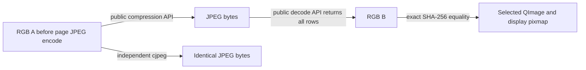

# Original page-buffer JPEG round trips (2026-10-09)

For the original RGB and gray controls, public API observations now connect
**RGB A → JPEG bytes → RGB B → the displayed page pixmap**. The JPEG bytes
are identical to an independent `cjpeg` quality-100, 4:2:0, integer-DCT
encoding of A. Returned decoder rows match B exactly, and B matches the
selected public QImage buffer and display pixmap. This explains the observed
two buffer representations in those controls. It does not establish a general
readiness rule, an undocumented cache implementation or the cause of the
original `7797…` document discrepancy under [Rust #441](https://github.com/rwv/caj2pdf-rust/issues/441).

The [metadata receipt](viewer-jpeg-roundtrip-20261009.json) retains the complete
96-candidate diagnostic, four separate holdout directions and all **12 viewer
sessions**, including two observer versions and the first collector's six
codec-analysis rejections. This is the scoped work for
[samples #74](https://github.com/rwv/caj2pdf-samples/issues/74). No real-document
acquisition, converter run or corpus compatibility pass is added.

## Exact diagnostic and independent holdouts

The [preceding RGB experiment](viewer-rgb-resampling-20261009.md) located
71,650 changed pixels before Qt display scaling, across both vector and image
panels. A finite diagnostic was frozen before execution: RGB and gray buffers
in both directions, qualities 95/100, sampling 1×1/2×1/2×2, integer/float
encoder DCT, integer decoder DCT and default/disabled smooth upsampling.
All 96 cases run with external `cjpeg`/`djpeg` 2.1.5. These are separate tool
executions within the same libjpeg-turbo implementation family; their role
here is to check byte/row identity. Every complete grid is
compared exactly; no parameter search continues after the recorded matrix.

| Retained original buffer direction | Exact candidate matches | Different candidates |
| --- | ---: | ---: |
| RGB A → B | 1 | 23 |
| RGB B → A | 0 | 24 |
| Gray A → B | 6 | 18 |
| Gray B → A | 0 | 24 |

The RGB match uses quality 100, 2×2 sampling, integer DCT in both tools and
default decoder upsampling. Gray matches share quality 100/integer DCT; its
three sampling choices and two upsampling choices do not distinguish this
gray input. There are zero unavailable candidate results. Quality 100 remains
lossy: the public [libjpeg-turbo usage manual](https://github.com/libjpeg-turbo/libjpeg-turbo/blob/main/doc/usage.txt)
describes unit quantizers while retaining sampling and rounding losses.
The versioned web path initially returned 404; installed 2.1.5 public API/usage
manuals and current upstream documentation were read instead. No codec
implementation source was inspected.

The identified RGB profile was then frozen for four further comparisons using
the previously retained [original native and PDF controls](viewer-page-buffer-20261009.md).
Both A → B holdouts match exactly; both B → A directions differ, at 41,439 and
11,742 pixels respectively. The unchanged prior A/B differences are:

| Original family | Buffer grid | A/B differing pixels | Channel delta | A → fixed JPEG → B |
| --- | --- | ---: | --- | --- |
| Font-free RGB PDF | 397×561 | 71,650 | -239…+255 | Exact |
| Font-free gray PDF | 397×561 | 3,655 | -1…+1 | Exact |
| Original native text control | 1003×1506 | 29,877 | -2…+2 | Exact holdout |
| Original Standard-14 PDF control | 397×561 | 8,254 | -1…+1 | Exact holdout |

These holdout identities provide evidence of the same numerical transformation;
actual JPEG API transitions are observed below for the RGB and gray controls.
No new native/PDF holdout viewer session is acquired.

## Public API observation and retained corrections

[`jpeg_observe.cpp`](../cajviewer/jpeg_observe.cpp) is an original pass-through
observer for public JPEG creation, configuration, memory source/destination,
scanline, finish and destroy interfaces. It hashes accepted RGB rows without
padding, records dimensions, component sampling, DCT selection and unit
quantizers, and hashes bounded encoded memory when those public APIs are used.
It neither reads vendor implementation nor alters codec settings or pixels.
It runs alongside the existing original public QImage/QPainter observers.

The first eight-session plan was frozen before launch. Its six instrumented
page states and two screenshot-only states all confirm, but the initial
collector rejects every codec trace because it incorrectly expects globally
unique sequence numbers in a log shared by multiple processes. Read-only
reanalysis retains physical line identity and marks the missing process
namespace explicitly. All six traces show the target A being encoded with
the measured profile. Their decoder calls return all rows then destroy the
JPEG object without calling `jpeg_finish_decompress`; the first observer
therefore records an incomplete lifecycle without exporting the output hash.
Those missing hashes are not retrospectively labeled as observed.

A separately frozen four-session extension adds explicit process IDs and
`RGB_ROWS_AT_DESTROY`. That event hashes all returned rows only when their
count equals the bounded image height. It is distinct from `FINISH_RGB` and
**does not assert finish/EOI validation**. Partial rows remain incomplete with
no success digest. Original API controls validate both endings and separate
process counter namespaces before this extension. The first eight sessions
are retained; this is an instrumentation extension, not a retry for matching
images. The source pixels, grids, markers and exact comparison remain fixed.

| Sessions | Input and route | Observer | Page result | Codec evidence |
| --- | --- | --- | --- | --- |
| 01, 04 | RGB, direct 5 | Initial | A | Target A encoded; process namespace unavailable |
| 02, 03 | RGB, 3→5 | Initial | B | Target A encoded; destroy output hash unavailable |
| 05 | Gray, direct 5 | Initial | A | Target A encoded; process namespace unavailable |
| 06 | Gray, 3→5 | Initial | B | Target A encoded; destroy output hash unavailable |
| 07 | RGB, direct 5 | None | Display A | Not instrumented |
| 08 | RGB, 3→5 | None | Display B | Not instrumented |
| 09 | RGB, direct 5 | Final | A | A encoded; no selected-page decode observed |
| 10 | RGB, 3→5 | Final | B | Complete selected hash chain |
| 11 | Gray, direct 5 | Final | A | A encoded; no selected-page decode observed |
| 12 | Gray, 3→5 | Final | B | Complete selected hash chain |

The two plans have SHA-256 identities
`a9579d83d22a10754e2775620c56c5fccf6d4131358c5719cabfa764143f3483`
and `d2ea8293354110b52c79dcd583b4c19ee6962156062e8a816435b51637c765e9`.
All twelve within-session screenshot pairs are equal. Page/zoom OCR, fixed
frame corners, source identities and public buffer hashes confirm the same
50%, six-page protocol as the preceding experiment. RGB cases additionally
use the published original page-five marker decoder; gray cases retain the
earlier field/grid/hash protocol.
The screenshot crop stays `[626,156,1023,718]`, a 397×562 grid; the selected
page buffer stays 397×561. No crop fitting, resampling or acceptance tolerance
is used. No-observer sessions exactly reproduce the two displayed variants;
this does not prove that observation hooks have no timing effect.

The initial combined observer binary is
`4a6d55fcb91e9941ec46627ca2f4a17a27b5d7da8d55cba012d204c9d56e236e`;
the final build is
`6e8d3f6456a0ec512c9e77d3b5957a7bbc59a17dacc61fd54c02835655d2f8a9`.
The initial source/binary, both builders, all plans, traces and analysis versions
remain external with identities in the receipt. A separate pre-acquisition
launcher test failed on a Qt data-symbol dependency; removing the empty Qt
byte-array construction and initializing hash contexts lazily fixed it before
any viewer launch. The failed preflight log remains retained.

## The observed hash chains



The selected RGB transition in session 10 is:

| Stage | SHA-256 |
| --- | --- |
| Encoding input RGB A | `da226c2436cb9b91342db788aaff4e0ea5babbb7433d450f36a422592c467000` |
| Encoded bytes, also identical to independent cjpeg output | `01ac45340c390ebf17f1ec6a3ce4a5688c0eeba600e265734c05504e8f164918` |
| Returned RGB B, selected QImage and pixmap | `62274bf2cc4fe9f1d02a9d5e3d86d6aaae851162bc454b34d7f5e4b18b226b1c` |

The selected gray transition in session 12 is:

| Stage | SHA-256 |
| --- | --- |
| Encoding input RGB A | `0aa149b1481a23a7ace2a0d153c5a9b2640239150d1c4991ed7e30f938e6a9a7` |
| Encoded bytes, also identical to independent cjpeg output | `eaa16dd15971855915bfd14d9bdc6e80f0bb1cb4cba94382237b3c7de0b3bea3` |
| Returned RGB B, selected QImage and pixmap | `f88ba07f749d7d099977cd381e7c1618a1d652525d8c77294dda743951bf746c` |

Both selected encoders observe quality 100, `JDCT_ISLOW`, Y/Cb/Cr sampling
2×2/1×1/1×1 and unit quantizers. Both selected decoders also observe integer
DCT and produce all 561 RGB rows. Their encoded input hashes equal the recorded
encoder outputs. The encode, completed decode-row hash and matching QImage
constructor observations occur in that order on the common monotonic clock.
The trace records process identity; no order is inferred by comparing UI Unix
timestamps against monotonic timestamps.

Each final trace includes two processes and has no event/context limit hit
or internal per-process sequence gap. Small original 64×32 image operations
remain explicitly outside the page-buffer hash selection: each final session
retains six unsupported-grid and six corresponding incomplete-finish records.
Those are not silently promoted to measured image evidence. The complete
metadata also includes all other codec events; only the two selected-page
chains above support the displayed-buffer claim.

“A” means the RGB buffer **before this observed page JPEG encoding**. It is
not a claim that every earlier renderer stage is lossless, that the document's
intended appearance is proved, or that original fonts/ornaments are known.
The exact byte chain establishes this representation change without identifying
an undocumented storage/cache implementation.

## Correctness boundary and validation

An independent original negative control changes just one red component from
64 to 65 in an otherwise constant 201×101 RGB image. The two distinct input
hashes produce identical JPEG bytes and identical decoded RGB under this
profile. The observer preserves their distinct pre-encoding hashes. Therefore,
applying JPEG to both sides and comparing the lossy outputs would conceal a
real input difference; it cannot be a replacement for original-content or
pre-encoding pixel evidence. No such normalization is applied here.

Ten original API tests pass without skips and run in Catalog CI. They cover
unchanged encoded bytes and decoded RGB with/without observation, row padding
and partial final reads, parameters and encoded-byte identities, preservation
of errno/floating exception state, grid/color/encoded-size refusals, context
and event limits, an incompatible ABI with an invalid pointer that must never
be dereferenced, fatal log failures, a launcher without Qt, distinct partial/
complete destroy paths, multiple process namespaces and the lossy-output
counterexample. All new code is original MIT.

The observer forwards public APIs and reads only the matching compiled ABI.
It is intended for the pinned Linux Qt5/JPEG environment, with QtCore available
when the target calls JPEG APIs. It keeps at most 16 contexts and 10,000 events
per process, hashes at most 4 Mi pixels on 200…4096 by 100…4096 RGB grids, and
hashes encoded memory up to 16 MiB in 64 KiB chunks. Missing/unsupported calls
and limit markers remain explicit. The PNG comparison reader retains its
16 MiB/4 Mi-pixel bounds. Repeated exact metrics are stored by canonical JSON
SHA-256 while every candidate identity and outcome remains in the receipt.

The viewer image remains
`sha256:cb5049d3448b6d5bcfd371cf195d522d637869dce075cb1650d74198875171de`.
All sessions use network none, read-only root/inputs, uid 1000, dropped
capabilities, no-new-privileges, 2 GiB memory/swap, two CPUs, 256 PIDs, bounded
tmpfs/files and a 90-second lifetime. No abort or OOM is observed; all inputs
are unchanged, all containers are removed and all **439 retained session-file
hashes** are rechecked. Peak container memory is 319,594,496…500,097,024 bytes;
these are observer/viewer measurements, not converter memory results.

The standalone numerical comparison can be reproduced using pinned original
RGB PPM input and complete decoded PPM output:

```sh
cjpeg -quality 100 -sample 2x2 -dct int -outfile /external/a.jpg /external/a.ppm
djpeg -dct int -rgb -pnm -outfile /external/decoded.ppm /external/a.jpg
python3 -m unittest discover -s research/conformance -p 'test_jpeg_observe.py' -v
```

The external driver remains specific to the pinned desktop environment.
No vendor or JPEG implementation, vendor font program/outline, foreign
converter or private HN/JBIG source is inspected or copied. Public API headers,
documentation and external black-box JPEG tools are used; document, pixel,
font, JPEG and binary bodies remain outside Git.

The original `7797…` case still needs its own established explanation and
readiness evidence. The native/PDF holdout match does not replace that check.
General readiness, native source fonts/ornaments, remaining refusals and
complete corpus correctness remain open under #441/#406 and samples #51.
The ledger remains **1,252 PASS / 18 FAIL / 27 UNSUPPORTED across 1,297 originals**,
with 35,587 accepted pages. No production API/output/support change or release.
